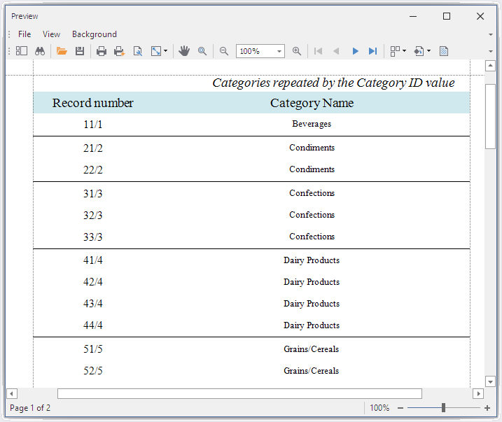

<!-- default badges list -->

<!-- default badges end -->
# How to Repeat the Detail Band a Different Number of Times 

In this example a detail band bound to data produces several rows in a document for a single record. The number of rows is calculated at runtme and equals to the current value of another data field.

If a report is **not bound** to a data source (the data source is empty or undefined), the [ReportPrintOptions.DetailCountOnEmptyDataSource](https://docs.devexpress.com/XtraReports/DevExpress.XtraReports.UI.ReportPrintOptions.DetailCountOnEmptyDataSource) property determines how many times the Detail band content is printed.
 
If a report is **bound to data**, you can **limit** the number of times the Detail band is printed with the [ReportPrintOptions.DetailCount](https://docs.devexpress.com/XtraReports/DevExpress.XtraReports.UI.ReportPrintOptions.DetailCount) property. In other words, if a data source contains one record, the **DetailCount** property does not enable us to print the Detail band more than once.

This example demonstrates how to print the Detail band for a single record multiple times. The number of times to repeat the Detal band is a value retrieved from another data field. The [DetailReportBand](https://docs.devexpress.com/XtraReports/DevExpress.XtraReports.UI.DetailReportBand) is unbound, and the the [ReportPrintOptions.DetailCountOnEmptyDataSource](https://docs.devexpress.com/XtraReports/DevExpress.XtraReports.UI.ReportPrintOptions.DetailCountOnEmptyDataSource) property is specified in the **DetailReportBand.BeforePrint** event handler.  

## Files to Look At

- [XtraReport1.cs](CS/RepeatDetailBandExample/XtraReport1.cs) ([XtraReport1.vb](VB/RepeatDetailBandExample/XtraReport1.vb))

## Documentation

- [Limit the Number of Records to Display](https://docs.devexpress.com/XtraReports/1184/detailed-guide-to-devexpress-reporting/shape-report-data/filter-data/data-filter-overview#printoptions)

## More Examples

- [How to add blank rows and fill the empty space between the Detail band and the next band or the end of the page](https://github.com/DevExpress-Examples/Reporting_how-to-print-detailband-multiple-times-regardless-of-the-number-of-records-e3740)
